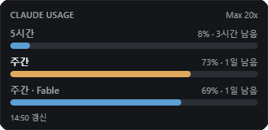
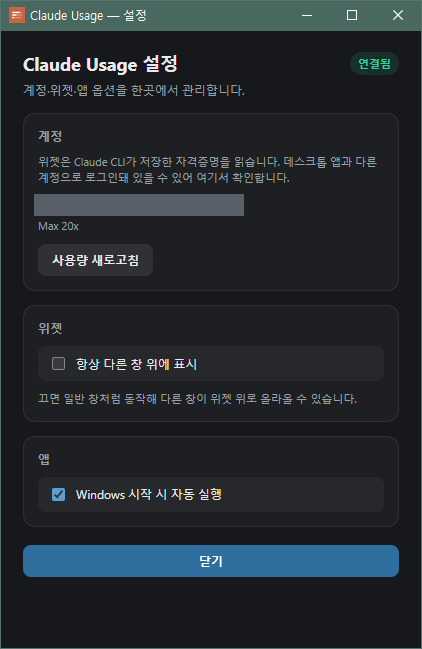

# Claude Usage Widget

Windows 바탕화면용 플로팅 위젯입니다. Claude Code의 **사용 한도**를 프로그레스바로 보여줍니다.

한도는 플랜에 따라 개수가 다릅니다. Max 계정이면 5시간 세션 · 주간 전체 · 모델별 주간이 각각 한 줄씩 나옵니다.



바 한 줄이 한도 하나입니다. 오른쪽에 사용률과 초기화까지 남은 시간이 붙습니다.

- **5시간** — 5시간 세션 한도
- **주간** — 주간 전체 한도
- **주간 · Fable** — 모델별 주간 한도. 모델 이름은 계정에 걸린 한도를 따라갑니다.

헤더 오른쪽은 플랜, 맨 아래는 마지막 갱신 시각입니다. 바 색은 70%부터 주황, 90%부터 빨강으로 바뀌고, 지금 소모 중인 한도는 라벨이 밝게 표시됩니다.

## 일반 사용자 (추천)

1. 프로젝트 폴더의 **`시작.bat`** 을 더블클릭하세요.
2. 처음 한 번만 릴리스 빌드·설치가 진행되고, 이후에는
   `%LOCALAPPDATA%\ClaudeUsageWidget\claude-usage-widget.exe` 가 바로 실행됩니다.
3. 바탕화면에 **Claude Usage Widget** 바로가기도 만들어 둡니다.
4. 위젯에서 **우클릭 → 설정** 으로 부팅 시 자동 실행을 켤 수 있습니다.

5. 같은 설정 창에서 **항상 다른 창 위에 표시** 를 끄면 일반 창처럼 동작해 다른 창이 위로 올라올 수 있습니다.

`target\debug\*.exe` 를 찾아 실행하면 **개발용**이라 화면이 비어 보이거나 안내 창만 뜹니다. 사용하지 마세요.

## 우클릭 메뉴와 설정 창

위젯 위에서 **우클릭**하면 **설정** 과 **종료** 두 항목이 나옵니다. 창이 트랙 수에 맞춰 줄어들어 항목이 늘면 메뉴가 잘리기 때문에, 나머지는 별도 설정 창으로 옮겼습니다.



- **계정** — CLI 로그인 계정의 이메일과 플랜을 보여줍니다 (위 이미지는 이메일을 가렸습니다). **사용량 새로고침** 은 다음 폴링을 기다리지 않고 바로 다시 조회합니다.
- **위젯** — **항상 다른 창 위에 표시** 를 끄면 일반 창처럼 동작합니다.
- **앱** — **Windows 시작 시 자동 실행** 으로 부팅 시 자동 실행을 켜고 끕니다. 개발 모드에서는 바꿀 수 없어 비활성으로 표시됩니다.

오른쪽 위 배지는 연결 상태(연결됨 · 로그인 필요 · 갱신 실패)입니다. **닫기** 나 `Esc` 로 닫습니다.

## 어느 계정의 사용량인가

위젯은 **CLI 로그인 계정**의 사용량을 보여줍니다. 확인 방법은 이렇습니다.

```bash
claude auth status
```

**우클릭 → 설정** 의 계정 카드에도 현재 계정 이메일과 플랜이 표시됩니다.

**Claude 데스크톱 앱의 로그인 계정과 다를 수 있습니다.** 데스크톱 앱은 자체 저장소(Chromium 세션)를 쓰고 위젯이 읽는 `~/.claude/.credentials.json` 과 별개입니다. 위젯에 다른 계정이 보이면 이렇게 맞추세요.

```bash
claude auth login
```

## 개발 실행

```powershell
npm install
npm run tauri dev
```

요구 사항: Windows + Claude Code 로그인, Node.js, Rust, Visual Studio C++ Build Tools, WebView2.

## 스크립트

| 명령 | 용도 |
|------|------|
| `시작.bat` / `npm run start:app` | 설치본 실행 (비개발자) |
| `npm run rebuild:app` | release 강제 재빌드·재시작 (작업 완료 후) |
| `npm run build:app` | 릴리스 빌드만 |
| `npm run tauri dev` | Vite + debug (개발) |
| `npm run make:icon` | 아이콘 재생성 |
| `npm run spike` | usage API 스파이크 |

## 동작 방식

```
~/.claude/.credentials.json  →  claudeAiOauth.accessToken
GET https://api.anthropic.com/api/oauth/usage      → limits[] (트랙)
GET https://api.anthropic.com/api/oauth/profile    → 계정·플랜
```

5분마다 폴링합니다.

## 주의

- 토큰은 **읽기만** 합니다. 갱신은 하지 않습니다 — Claude Code와 refresh token 회전이 겹치면 양쪽 로그인이 함께 풀릴 수 있습니다.
- accessToken은 수명이 8시간쯤입니다. 만료되면 위젯이 "Claude 로그인 필요"를 표시하고, Claude Code를 한 번 실행하면 다시 채워집니다.
- 이 엔드포인트는 **비공식**이며 언제든 깨질 수 있습니다. 값이 이상하면 공식 대시보드가 기준입니다.
- 토큰 값은 로그·화면·커밋 어디에도 남기지 않습니다.
